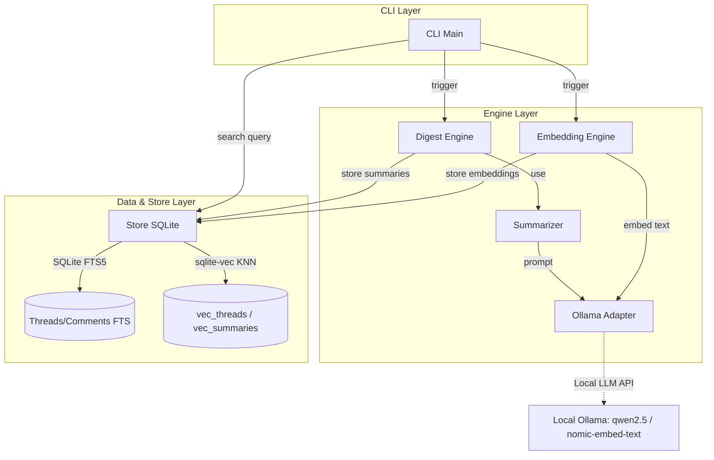
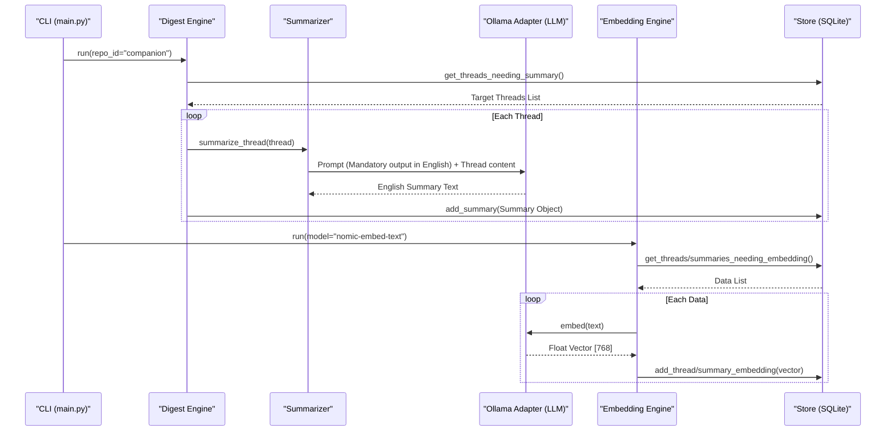
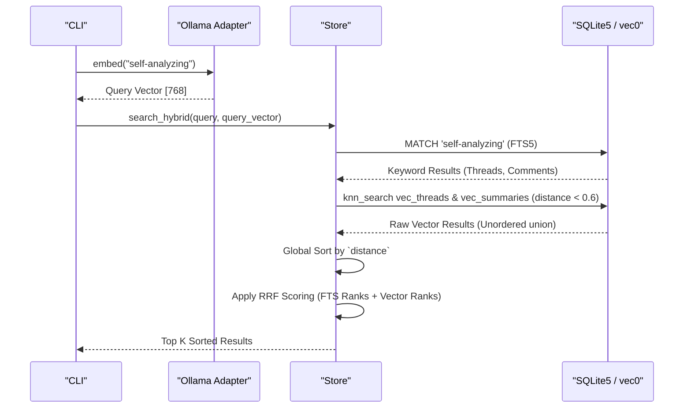

# Octopith 의미 기반 검색 엔진 (PoC) 상세 설계 문서

본 문서는 현재 구현된 Octopith 시스템의 아키텍처와 핵심 검색/요약 파이프라인에 대한 상세 설계 및 로직을 정리한 문서입니다. 향후 개선된 시스템 설계를 위한 기준 자료로 활용됩니다.

---

## 1. High-Level Design (고수준 아키텍처)

시스템은 크게 사용자 명령을 처리하는 **CLI 모듈**, 데이터를 수집하고 요약/임베딩을 수행하는 **Engine 모듈**, 그리고 데이터를 영속화하고 벡터/FTS 하이브리드 검색을 제공하는 **DB(Store) 모듈**로 구성됩니다.



### 1.1 핵심 컴포넌트 역할
- **CLI (`main.py`)**: 사용자 명령(`digest`, `search` 등)을 파싱하고 적절한 Engine이나 Store의 메서드를 호출합니다.
- **Digest Engine**: DB에서 아직 요약되지 않은 이슈/댓글을 가져와 LLM(`Summarizer`)에 전달하고, 생성된 요약본을 DB에 저장합니다.
- **Embedding Engine**: 본문이나 요약본의 텍스트를 임베딩 모델을 통해 벡터로 변환하여 저장합니다.
- **Store (`store.py`)**: SQLite와 `sqlite-vec` 익스텐션을 래핑하여 데이터의 CRUD와 하이브리드 검색(FTS5 + Vector KNN) 로직을 관장합니다.

---

## 2. Low-Level Detail (저수준 상세 설계)

핵심 비즈니스 흐름인 **데이터 다이제스트(요약+임베딩) 파이프라인**과 **하이브리드 검색 파이프라인**을 상세히 다룹니다.

### 2.1 Digest 파이프라인 시퀀스 다이어그램

데이터가 DB에 색인되고 벡터 테이블에 적재되기까지의 흐름입니다. (다국어 호환성을 위한 영어 요약 강제화 로직 포함)



### 2.2 하이브리드 검색 (Hybrid Search) 시퀀스 다이어그램 및 Pseudo-code

FTS5 키워드 매칭 결과와 sqlite-vec 기반의 KNN 매칭 결과를 병합(Reciprocal Rank Fusion)하여 최종 순위를 산출하는 흐름입니다.



#### 하이브리드 검색 핵심 Pseudo-code
검색 시 발생했던 **거리 기반 정렬 오류**를 방지하는 정렬 로직이 포함된 슈도코드입니다.

```python
def search_hybrid(query_text, query_vector, limit=10):
    # 1. 키워드 기반 FTS 검색 수행 (SQLite FTS5)
    fts_results = execute_fts_search(query_text)

    # 2. 벡터 기반 시맨틱 검색 수행 (sqlite-vec)
    # 본문(Threads)과 요약(Summaries) 테이블을 각각 조회
    threads_vec = execute_knn("vec_threads", query_vector, limit, max_distance=0.6)
    summaries_vec = execute_knn("vec_summaries", query_vector, limit, max_distance=0.6)
    
    # 두 결과를 합친 후 반드시 거리(Distance) 기준으로 재정렬! (핵심 버그 픽스 지점)
    combined_vec_results = threads_vec + summaries_vec
    combined_vec_results.sort(key=lambda x: x.distance) 
    
    # 상위 limit 개수만 슬라이싱
    vec_results = combined_vec_results[:limit]

    # 3. Reciprocal Rank Fusion (RRF) 스코어링
    scores = {}
    k_constant = 60
    
    for rank, res in enumerate(fts_results, start=1):
        scores[res.id] = scores.get(res.id, 0) + (1 / (k_constant + rank))
        
    for rank, res in enumerate(vec_results, start=1):
        scores[res.id] = scores.get(res.id, 0) + (1 / (k_constant + rank))
        
    # 4. 최종 스코어 기준으로 내림차순 정렬하여 반환
    final_results = sort_by_score(scores)
    return final_results[:limit]
```
