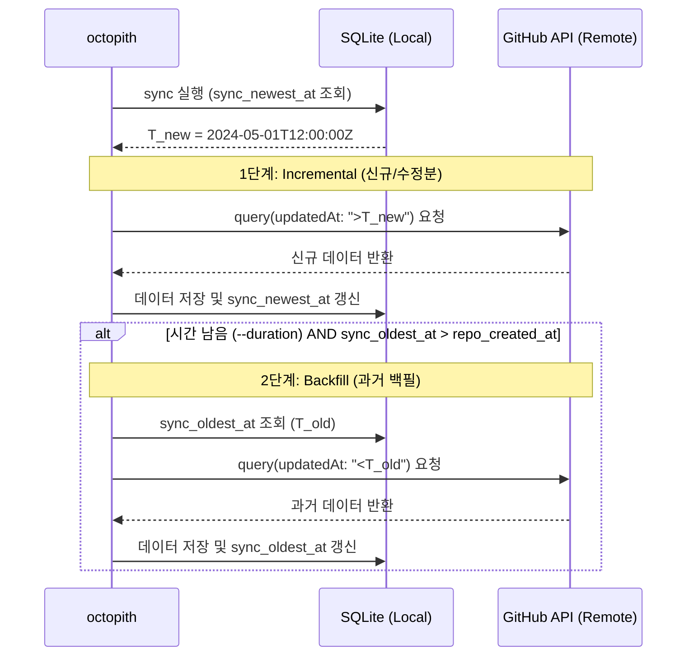

## 1. 개요 (Overview)
**Octopith**는 GitHub의 Issue, Discussion 데이터를 로컬 LLM으로 구조화하고, 하이브리드 검색을 통해 개인용 지식 베이스를 구축하는 도구입니다. 특히, 더 복잡한 Agent가 효율적으로 지식을 활용할 수 있도록 돕는 **전처리기(Preprocessor)** 역할을 수행합니다.

## 2. 핵심 설계 원칙 (Design Principles)
- **CLI-First Architecture**: 모든 기능은 명령줄 인터페이스(CLI)를 통해 제공되며, 자동화 및 파이프라인 통합이 용이하도록 설계합니다.
- **Agent-Friendly Output**: CLI의 출력은 상위 Agent가 쉽게 파싱하고 활용할 수 있도록 구조화된 데이터 포맷(예: JSON)을 제공해야 합니다.
- **Minimize False Negatives**: 검색 결과에서 관련 있는 문서가 누락되는 것(False Negative)을 최소화하는 데 집중합니다. 약간의 관련 없는 문서가 포함되는 것(False Positive)은 감수하더라도 필수적인 정보가 누락되지 않도록 하며, 가능하면 정밀도(Precision)도 함께 유지하는 방향을 지향합니다.
- **Stability Over Efficiency**: 최고의 성능이나 최적화보다는 데이터의 무결성과 시스템의 견고함을 최우선으로 합니다. 약간의 중복 처리나 속도 저하가 있더라도, 누락 없는 동기화와 안정적인 로컬 실행 환경을 지향합니다.
- **Single Source of Truth (SSOT)**: 원본 데이터, 동기화 상태, 요약본, 임베딩을 단일 SQLite DB에서 관리합니다.
- **Idempotent & Stateful Sync**: `node_id` 기반 멱등성을 보장하며, 이중 경계 마커(`sync_newest_at`, `sync_oldest_at`)를 활용해 신규 수집과 과거 백필을 안정적으로 수행합니다.
- **Content-Aware Invalidation**: 본문 해시(`content_hash`)를 비교하여 실제 변경 시에만 가공 파이프라인을 가동합니다.
- **Model Agnostic**: 요약 및 임베딩 모델을 독립 테이블로 관리하여 멀티 모델 평가 환경을 제공합니다.
- **Pluggable Inference Backend (Adapter Pattern)**: 특정 추론 엔진(Ollama 등)에 종속되지 않도록 내부 어댑터 구조를 사용하여, 다양한 엔진을 지원함과 동시에 각 엔진의 특화 기능을 최적화하여 활용합니다.

## 3. CLI 설계 원칙 (CLI Design Principles)
Octopith의 CLI는 사람 사용자와 AI 에이전트 모두에게 친숙하도록 설계되었습니다.

### 1) Single Source of Truth (SSOT)
- 모든 상수 값(예: Match Type, 상태 코드 등)은 `src/octopith/db/constants.py`와 같이 중앙 집중화된 위치에서 관리합니다.
- CLI 도움말 메시지는 이 상수를 동적으로 쿼리하여, 코드와 문서 간의 불일치를 원천 차단합니다.

### 2) 사용자 중심의 추상화 (User-Centric Abstraction)
- 도움말 상단에는 기술적 메커니즘(예: "FTS5", "Vector Search")보다는 검색 결과로 얻게 될 **정보의 가치와 맥락**을 먼저 설명합니다.
- 기술적 디테일은 필요한 경우에만 옵션 설명에서 제공하며, 기본 안내는 "지식 검색"과 같은 직관적인 언어를 사용합니다.

### 3) 구조화된 도움말 레이아웃 (Structured Layout)
- 도움말은 `OUTPUT INFORMATION`과 `CONTEXTUAL DETAILS` 등의 섹션으로 명확히 구분하여 제공합니다.
- Click의 `\b` 마커를 활용하여 100컬럼 이내에서 의도한 레이아웃(개행, 들여쓰기)이 유지되도록 강제합니다.

### 4) 에이전트 상호운용성 (Agent Interoperability)
- 기본 출력은 정형화된 **JSON**을 제공하며, 사람이 직접 확인할 때만 `--rich` 옵션을 사용하도록 유도합니다.
- 식별자는 `<owner>/<repo>#<number>` 표준 형식을 사용하여 에이전트가 모호함 없이 후속 작업을 수행할 수 있도록 합니다.

## 4. 기술 스택 (Technical Stack)
- **Runtime**: Python 3.12+ (`uv`, `asyncio`, `Click` 기반 CLI 구현)
- **Data Source**: GitHub GraphQL API v4 (`httpx` 비동기 통신)
- **Database**: **SQLite 3** (`sqlite-vec`, `FTS5`)
- **Intelligence**: Local LLM Inference Engines (Ollama, vLLM, llama.cpp 등)

## 4. 사용자 시나리오 및 워크플로우 (User Scenarios & UX)

### 4.1 시나리오 A: 최초 설정 및 첫 번째 저장소 탐색 (Getting Started)
> **UX 목표**: "설치 후 5분 내에 첫 번째 저장소의 모든 데이터를 확보하고 탐색을 시작한다."

#### 1) 초기 설정 (인증 및 모델)
GitHub 토큰을 설정하고 요약/임베딩 모델을 지정합니다.

```bash
# GitHub 인증 토큰 설정
export OCTOPITH_GITHUB_TOKEN="ghp_xxxx..."

# 요약 및 임베딩 모델 지정 (미등록 시 대화형 등록 진행)
octopith summary-model use ollama/qwen2.5:3b
octopith embedding-model use ollama/nomic-embed-text
```

#### 2) 첫 번째 동기화
저장소 데이터를 로컬로 수집합니다. 저장소 크기에 따라 적절한 방식을 선택합니다.

**작은 저장소는 한 번에 동기화:**
```bash
# 전체 데이터를 전수 수집 (Full Sync)
octopith sync https://github.com/parjong/companion
```

**큰 저장소는 시간을 지정하여 나누어 동기화:**
```bash
# 30분 동안만 동기화 진행 (이후 다시 실행 시 이어서 수집)
octopith sync https://github.com/parjong/companion --duration 30m
```

#### 3) 즉시 키워드 탐색 (고속 모드)
동기화 직후 요약이 없더라도 고속 모드로 검색을 수행할 수 있습니다.

```bash
# 아키텍처 관련 키워드 검색 (FTS 전용)
octopith search "architecture" --fast
```

### 4.2 시나리오 B: 지식 범위 확장 (Knowledge Expansion)
> **UX 목표**: "여러 저장소를 통합하여 나만의 거대한 지식 창고를 구축한다."

#### 1) 다중 저장소 추가
추가하고 싶은 저장소들을 차례로 동기화합니다.
```bash
octopith sync https://github.com/facebook/react
octopith sync https://github.com/microsoft/vscode
```

#### 2) 통합 검색
특정 저장소를 지정하지 않으면 내가 확보한 모든 지식 영역을 대상으로 검색하며, 필요시 특정 저장소로 범위를 한정할 수 있습니다.

**전체 저장소 대상 검색:**
```bash
# 동기화된 모든 저장소에서 검색
octopith search "architecture decision"
```

**특정 저장소로 범위 한정:**
```bash
# 특정 저장소(예: companion) 내에서만 검색
octopith search "architecture decision" --repo parjong/companion
```

**여러 저장소 선택 검색:**
```bash
# 연관된 여러 저장소(예: companion, react) 내에서만 검색
octopith search "architecture decision" --repo parjong/companion --repo facebook/react
```

### 4.3 시나리오 C: 지능형 지식 베이스 구축 (Time-boxed)
> **UX 목표**: "사용 가능한 시간 동안 AI가 지식을 자동으로 정리(Digest)하고 검색 품질을 강화한다."

#### 1) 통합 지식 가공 (Digest)
따로 인덱싱을 호출할 필요 없이, 할당된 시간 동안 요약과 임베딩 생성을 동시에 진행합니다.
```bash
# 30분 동안 요약 및 임베딩 생성 통합 진행
octopith digest --duration 30m
```

#### 2) 강화된 시맨틱 검색
별도의 옵션 없이도 AI가 문맥을 파악하여 가장 관련성 높은 결과를 반환합니다.
```bash
# 질문의 의도를 파악한 하이브리드 검색 수행 (기본값)
octopith search "How to handle exponential backoff?"
```

### 4.4 시나리오 D: 변경사항 동기화 및 지식 유지
> **UX 목표**: "업데이트된 내용만 골라내어 최소한의 리소스로 지식을 최신화한다."

#### 1) 저장소 증분 업데이트
정기적인 유지보수 시에는 시간을 할당하여 점진적으로 최신화하는 것을 권장합니다.

**기본 유지보수 (시간 제한):**
```bash
# 매일 15분씩만 투자하여 모든 저장소의 변경사항을 점진적으로 수집
octopith sync --duration 15m
```

**전체 동기화 (시간 제한 없음):**
```bash
# 모든 저장소의 변경사항을 끝까지 수집
octopith sync

# 특정 여러 저장소만 선별적으로 업데이트
octopith sync https://github.com/parjong/companion https://github.com/google/guava
```

#### 2) 선별적 재가공 (Digest)
해시 비교를 통해 내용이 변한 항목만 LLM이 다시 요약하고 인덱싱합니다. (시간 제한 모드 지원)
```bash
# 모든 저장소의 변경된 항목만 선별 요약 및 인덱싱
octopith digest --duration 10m
```

### 4.5 시나리오 E: 모델 평가 및 교체 (Migration)
> **UX 목표**: "더 좋은 최신 모델이 나왔을 때, 기존 지식을 유지하면서 안전하게 모델을 테스트하고 교체한다."

#### 1) 신규 모델 등록
새로운 요약 모델을 시스템에 등록합니다.
```bash
octopith summary-model add ollama/llama3.2:3b
```

#### 2) 비교 평가용 가공
전체 데이터를 다시 만들지 않고, 특정 범위만 신규 모델로 요약 및 인덱싱하여 품질을 비교합니다.
```bash
octopith digest --model ollama/llama3.2:3b --duration 5m
```

#### 3) 활성 모델 교체
품질이 만족스러우면 요약용 기본 모델을 변경합니다.
```bash
octopith summary-model use ollama/llama3.2:3b
```

## 5. 데이터 모델 (Data Model)
> [!IMPORTANT]
> 본 설계에서 사용하는 **`node_id`**는 GitHub GraphQL API에서 제공하는 **Global Unique ID**(Base64 Encoded String)를 의미합니다. 이는 저장소 내부는 물론 인스턴스 전체에서 객체를 유일하게 식별할 수 있는 키이며, 시스템의 **멱등성(Idempotency)** 보장을 위한 Primary Key로 사용됩니다.

### 5.1 핵심 테이블 및 필드 정의
- **`repositories`**: 저장소 정보 및 동기화 기준점 관리.
  - `id` (node_id PK), `api_url`, `full_name`.
  - `sync_newest_at`: 증분 수집 상한선 (Index 권장 - 신규/수정분 수집용).
  - `sync_oldest_at`: 과거 백필 하한선 (Index 권장 - 과거 데이터 소급용).
  - `repo_created_at`: 저장소 원본 생성 시각 (백필 종료 기준점).
- **`threads`**: Issue/Discussion 통합 컨테이너.
  - `id` (node_id PK), `repo_id` (FK Index), `type`, `author`, `title`, `body`.
  - `last_known_updated_at`: (Index 권장 - 정렬 및 동기화용).
  - `title_hash`, `body_hash`: Invalidation용.
- **`comments`**: 개별 댓글 데이터.
  - `id` (node_id PK), `thread_id` (FK Index), `author`, `body`, `created_at`.
- **`summaries`**: LLM 가공 결과물 (Digest).
  - `id` (PK, Auto-increment).
  - `target_id`: thread_id 또는 comment_id (Index).
  - `summary_type_id`: 요약 유형 (FK to `summary_types.id`).
  - `model_variant_id`: 사용된 구체적 모델 변종 ID (FK to `model_variants.id`).
  - `content`: 요약 텍스트.
  - `prompt_version`: 가공 당시의 로직 버전 (`model_variants.config_data.logic_version` 스냅샷).
  - `created_at`.
- **`summary_types`**: 요약/분석 유형의 메타데이터 관리.
  - `id` (string PK - e.g., 'TROUBLESHOOTING', 'DECISION').
  - `description`: 해당 유형의 목적 및 사용 시점 (When-to-use).
  - `format_spec`: 결과물의 구조 정의 (JSON Schema 또는 포맷 가이드).
  - `created_at`.
  - > [!NOTE]
    > 위 필드 구성은 초기 설계안이며, 향후 실제 요약 예제 및 분석 요구사항이 구체화됨에 따라 필드 구조가 확장되거나 변경될 수 있습니다.
- **`model_variants`**: 모델별 구체적 설정 및 프롬프트 관리 (Physical Instance).
  - `id` (PK, Auto-increment).
  - `engine`: 추론 엔진 (e.g., `ollama`, `vllm`).
  - `model_name`: 베이스 모델 명칭 (e.g., `qwen2.5:3b`).
  - `variant_tag`: 변종 식별 태그 (e.g., `v1`, `v2-brief`).
  - `type`: 모델 유형 (summary/embedding).
  - `config_schema`: `config_data` JSON의 구조 버전 (e.g., 'v1').
  - `config_data`: 구체적인 추론 설정, 프롬프트, **생성 시각** 포함 (JSON).
- **`models`**: 논리적 모델 에일리어스 및 라우팅 (Logical Router).
  - `id` (string PK): 사용자가 호출할 논리적 명칭 (e.g., `qwen-std`, `summary-pro`).
  - `variant_id`: 현재 연결된 변종 (FK to `model_variants.id`).
- **`threads_fts` (Virtual)**: SQLite FTS5 기반 키워드 검색 테이블.
- **`summaries_vec` (Virtual)**: `sqlite-vec` 기반 벡터 검색 테이블.
- **`configs`**: 시스템 설정 정보 (Rate Limit, API 설정 등).
  - `key` (PK), `value`, `description`.

### 5.4 스키마 버전 관리 전략 (Versioning)
향후 DB 구조 변경에 대비하여 데이터베이스 파일과 독립적인 메타데이터 파일을 유지합니다.

- **관리 파일**: `[db_name].toml` (e.g., `octopith.db.toml`)
- **주요 필드**:
  - `schema_version`: 현재 DB의 스키마 버전 식별자 (e.g., "v1.0.0").
  - `migration_at`: 마지막 마이그레이션 수행 시각.
- **활용**: 어플리케이션 구동 시 해당 TOML 파일을 먼저 읽어 DB 파일과의 정합성을 확인하고, 필요한 경우 자동 마이그레이션 또는 업그레이드 경고를 수행합니다.

### 5.2 인덱스 및 성능 최적화 전략
- **복합 인덱스**: `summaries(target_id, model_id)`를 통해 특정 모델의 가공 여부를 즉시 판단.
- **FTS5 통합**: `threads` 테이블의 CUD 발생 시 트리거를 통해 `threads_fts` 자동 동기화.
- **WAL 모드**: 데이터베이스 연결 시 `PRAGMA journal_mode=WAL;`을 상시 활성화하여 수집 중 검색 지연 방지.
- **무결성**: `ON DELETE CASCADE` 설정을 통해 저장소 삭제 시 연관된 스레드, 댓글, 요약이 깨끗이 정리되도록 설계.

### 5.3 JSON Schema 정의 (Model Variant Config)
`model_variants` 테이블의 `config_data` 필드에 저장되는 데이터의 표준 구조입니다.

#### 1) 공통 설정 (Base Config)
```json
{
  "api_base": "string (Optional)",
  "timeout": "int (Default: 30)"
}
```

#### 2) 요약 모델 설정 (Summary Model)
```json
{
  "logic_version": "string (e.g., 'v1.2' or content hash)",
  "max_tokens": "int",
  "temperature": "float",
  "top_p": "float",
  "system_prompt": "string (Required - variant specific)",
  "prompt_template": "string (Optional override)"
}
```

#### 3) 임베딩 모델 설정 (Embedding Model)
```json
{
  "dimension": "int (Required)",
  "batch_size": "int (Default: 32)"
}
```

## 6. 주요 시스템 프로세스
### 6.1 증분 동기화 및 Rate Control (Sync Strategy)
- **Full vs Incremental**: 
  - `sync_oldest_at > repo_created_at` 인 경우: 아직 과거 데이터가 남았으므로 `updated:<sync_oldest_at` 방향으로 **Backfill Sync** 수행.
  - 상시 동기화: `updated:>sync_newest_at` 방향으로 **Incremental Sync** 수행.
- **Host-based Rate Limiting**: 호스트별로 독립적인 동시 요청 수(Concurrency) 및 지연 시간(Delay)을 적용.
  - `github.com`: Secondary Rate Limit 방지를 위해 보수적 속도 적용.
  - `Enterprise Host`: 내부 망 속도 및 설정에 따라 더 높은 처리량 허용.
- **Dynamic Configuration**: `configs` 테이블에 저장된 호스트별 속도 설정(`sync_rate_<hostname>`)을 참조하여 런타임에 조절 가능.
- **Adaptive Backoff**: API 응답의 `x-ratelimit-remaining` 헤더를 감시하여, 할당량 부족 시 자동으로 요청 간격을 늘리는 적응형 로직 포함.
- **Stable Sync**: 휘발성 있는 GraphQL Cursor 대신 `updatedAt` 시각을 기준으로 범위를 조절하여 수집. 중단 시 마지막 아이템의 시각을 저장하여 재개.
- **Atomic Commit**: 페이지 단위 수집 성공 시에만 로컬 동기화 마커(`sync_newest_at`, `sync_oldest_at`)를 갱신하여 정합성 보장.

### 6.2 지능형 지식 가공 (Smart Digest)
- **Task Prioritization**: 다음 우선순위에 따라 가공 대상을 자동으로 선정.
  1. **Hierarchy**: 상위 요약(`THREAD_FULL`)을 위해 필요한 하위 요약(`COMMENT_ATOM`) 우선 처리.
  2. **Recency (LIFO)**: 사용자가 가장 최근에 확인한(또는 업데이트된) 이슈부터 처리하여 체감 품질 향상.
- **Time-boxing**: `--duration` 옵션 지정 시, 해당 시간 내에 처리가능한 최적의 작업량을 계산하여 실행.
- **Atomic Progress**: 개별 요약 완료 시마다 즉시 DB에 커밋하여, 중단되더라도 작업 결과 보존.
### 6.3 처리 성능 및 병렬 처리 전략 (Concurrency Strategy)
- **고속 수집 (`fetch`)**: **Async IO (`asyncio` + `httpx`)** 기반. 수많은 API 호출을 비동기로 처리하여 네트워크 대기 시간을 최소화하고 처리량을 극대화.
- **저속 가공 (`digest`)**: **Sequential/Batch Processing**. GPU 메모리 및 모델 부하를 고려하여 순차적으로 처리하되, 엔진 어댑터 수준에서 배치 최적화 수행.
- **상태 전이**: 데이터 수집 직후 DB에 즉시 반영되어 키워드 검색이 가능해지며, 요약/인덱싱 작업은 별도 단계(`digest`)로 진행되는 **Decoupled Pipeline**.
### 6.4 고재현율 세밀 매칭 검색 전략 (Granular High-Recall Search)
> **목표**: 관련 있는 모든 정보 조각(제목, 본문, 댓글)을 하나도 놓치지 않고(False Negative 최소화) 개별 결과로 반환하여, 후처리 에이전트에게 풍부한 원재료를 제공합니다.

- **Granular Retrieval (세밀한 수집)**:
  - 인간 중심의 검색 엔진처럼 결과를 이슈 단위로 묶어서 요약(Collapse)하지 않습니다. 
  - **제목 매칭, 본문 매칭, 개별 댓글 매칭**을 각각 독립된 검색 결과(Hit)로 취급하여 반환합니다.
  - 이는 하위 Agent가 특정 이슈의 여러 맥락 중 정확히 어떤 부분(댓글 등)이 질문과 연관되었는지 직접 판단하고 후처리할 수 있도록 돕기 위함입니다.
- **Hybrid Search (RRF)**:
  - FTS5의 키워드 점수와 벡터 검색의 유사도 점수를 **Reciprocal Rank Fusion(RRF)** 알고리즘으로 결합합니다.
  - 순위 산정의 최소 단위는 개별 노드(이슈 본문 또는 특정 댓글)입니다.
- **Agent-First Raw Data**:
  - 결과에는 `match_id`와 `match_url`을 포함하여, 에이전트가 즉시 특정 댓글의 원문으로 접근하거나 해당 위치를 참조할 수 있도록 합니다.
  - **Structured Match Info**: 후속 도구의 파싱 편의를 위해 매칭 정보를 이원화하여 제공합니다.
    - `match_sources` (JSON List): `["fts_title", "fts_body", "vector_content"]` 등 Snake Case 태그 리스트.
    - `match_label` (String): `"Keyword: Title + Semantic: Content"` 등 인간 가독용 라벨.

## 7. CLI 인터페이스 (`octopith`)

### 7.1 설계 원칙
- **Core Actions**: 빈번하게 사용되는 핵심 시나리오는 최상위 명령어로 노출하여 접근성을 극대화합니다 (`sync`, `digest`, `search`).
- **Supplementary Object-Action**: 핵심 외의 조회, 관리 기능은 **Object-Action** 패턴을 적용하여 논리적으로 그룹화합니다 (`thread show`, `config list`).

### 7.2 주요 명령어 구조
- **Core Actions**
    - `sync [<repo_url>...]`: 데이터 수집 (GitHub -> Local)
    - `digest [--duration <time>]`: 요약 및 인덱싱 가공
    - `search <query>`: 통합 검색
- **Object-Action (Supplementary)**
    - **`thread`**: 개별 이슈/토론 조회
        - `show <id>`: 특정 이슈의 상세 정보 및 AI 요약본 전문 조회
    - **`config`**: 환경 설정 관리 (`set`, `get`, `list`)
    - **`summary-model` / `embedding-model`**: 모델 별칭 및 설정 관리

## 8. 안정적 동기화 전략 (Stable Sync Strategy)
- **이중 경계 관리 (Dual-Boundary)**:
  - **상한선 (`sync_newest_at`)**: 신규 데이터 및 수정 사항을 감지하기 위한 마커. 매 동기화 시 이 시점 이후(`updated:>T`)의 데이터를 가장 먼저 확인.
  - **하한선 (`sync_oldest_at`)**: 과거 데이터를 백필(Backfill)하기 위한 마커. `sync_oldest_at <= repo_created_at`이 될 때까지 `updated:<T` 방향으로 과거 데이터를 소급 수집.
- **멱등성 처리**: 동일 시각에 여러 아이템이 존재할 경우 페이지 경계에서 일부 중복 수집이 발생할 수 있으나, SQLite의 `INSERT OR REPLACE`와 `node_id` PK를 통해 데이터 정합성을 완벽히 유지.

## 9. 제약 사항 및 환경 설정 (Considerations & Environments)
### 9.1 환경 변수 및 파일 배치 (Environments & Layout)
Octopith는 모든 상태를 `OCTOPITH_CONFIG_DIR` 하위에서 관리합니다.

- **`OCTOPITH_CONFIG_DIR`**: 모든 설정 및 데이터가 저장되는 루트 디렉토리.
  - **기본값**: `~/.config/octopith` (Linux/macOS)
- **`OCTOPITH_GITHUB_TOKEN`**: GitHub API 인증용 토큰 (필수).
- **`OCTOPITH_DB_PATH`**: SQLite 데이터베이스 파일 이름 또는 경로.
  - **기본값**: `$OCTOPITH_CONFIG_DIR/octopith.sqlite`

#### 표준 파일 배치 구조
```text
$OCTOPITH_CONFIG_DIR/
├── octopith.sqlite      # SQLite 데이터베이스 (Main Data)
├── octopith.sqlite.toml # 스키마 버전 및 마이그레이션 메타데이터
└── config.toml          # (선택) 정적 시스템 설정
```

### 9.2 주요 제약 사항
- **Authentication**: 멀티 인스턴스(GHE) 지원 시 인스턴스별 환경 변수 매핑 기능이 필요합니다.
- **Resource**: 모델 스위칭 시 GPU 메모리 관리 및 추론 엔진 동시 요청 제어.
- **API**: GitHub GraphQL 쿼리 복잡도 및 Rate Limit 대응.

## 10. 단계별 실행 계획 (Roadmap)
- [ ] **Phase 1: Foundation**: `repositories` 및 증분 Fetcher 구현.
- [ ] **Phase 2: Pipeline**: 댓글 스레드 구조 기반 요약 및 Invalidation 로직.
- [ ] **Phase 3: Retrieval**: 하이브리드 검색 및 멀티 모델 평가.

---

## [부록] 증분 동기화 및 업데이트 메커니즘 (Appendix: Sync Logic)

### A.1 증분 동기화 프로세스 (Mermaid Sequence)


### A.2 GitHub GraphQL 증분 쿼리 예시
증분 수집 시 다음과 같은 `search` 쿼리를 사용하여 `last_synced_at` 이후 업데이트된 항목만 효율적으로 가져옵니다.

```graphql
query ($queryString: String!, $cursor: String) {
  search(query: $queryString, type: ISSUE, first: 100, after: $cursor) {
    nodes {
      ... on Issue {
        id
        title
        body
        updatedAt  # DB의 last_known_updated_at으로 매핑
        author { login }
        # ... 기타 필요한 필드
      }
    }
    pageInfo {
      endCursor
      hasNextPage
    }
  }
}
# $queryString 예시 (Incremental): "repo:owner/repo is:issue updated:>2024-05-01T12:00:00Z"
# $queryString 예시 (Backfill): "repo:owner/repo is:issue updated:<2024-04-01T10:00:00Z"
```

### A.3 용어 매핑 및 역할 (Terminology & Mapping)

| 출처 | 용어 (Field/Term) | 역할 및 설명 | 로컬 매핑 필드 (Local DB) |
| :--- | :--- | :--- | :--- |
| **GitHub** | `node_id` | 객체의 전역 고유 식별자 | `id` (PK) |
| **GitHub** | `updatedAt` | 원본 서버의 최종 수정 시각 | `last_known_updated_at` |
| **Local DB** | `sync_newest_at` | 상향 동기화 기준 시점 | `repositories.sync_newest_at` |
| **Local DB** | `sync_oldest_at` | 하향(백필) 동기화 기준 시점 | `repositories.sync_oldest_at` |
| **Local DB** | `title_hash` | 제목의 의미적 변경 감지용 해시 | `threads.title_hash` |
| **Local DB** | `body_hash` | 본문의 내용 변경 감지용 해시 | `threads.body_hash` |

### A.4 핵심 필드의 동작 상세 (Field Logic)
1. **`last_known_updated_at` (Snapshot Time)**:
   - GitHub 서버가 해당 콘텐츠의 수정을 기록한 시점 중, 우리 시스템이 가장 마지막으로 확인한 시각입니다.
   - 로컬 DB는 이 스냅샷 시각을 보존하여, 실제 원본 콘텐츠의 변경 여부를 추적합니다.

2. **`sync_newest_at` & `sync_oldest_at` (Sync State)**:
   - 저장소 단위의 양방향 동기화 커서입니다. `sync_newest_at`은 최신성을 보장하고, `sync_oldest_at`은 과거 지식의 완결성을 보장합니다.

3. **`title_hash`, `body_hash` 및 `created_at` (정밀 무효화 메커니즘)**:
   - **Title 수정 시**: `title_hash`(정규화된 텍스트 기준)가 변경되면 검색 인덱스(FTS)를 업데이트합니다. 단, 요약본의 의미적 변화가 크지 않다고 판단되면 LLM 재실행은 생략할 수 있습니다.
   - **Body 수정 시**: `body_hash`가 변경되면 해당 Thread의 모든 요약(`THREAD_BODY`, `THREAD_FULL`)을 무효화하고 재생성합니다.
   - **Comment 수정 시**: 해당 댓글의 `content_hash`가 변경되면 `COMMENT_ATOM`과 부모의 `THREAD_FULL`을 무효화합니다.
   - **정규화(Normalization)**: 제목 해시 생성 시 공백, 특수문자, 대소문자 등을 정규화하여 사소한 오타 수정 등으로 인한 불필요한 재연산을 방지합니다.
